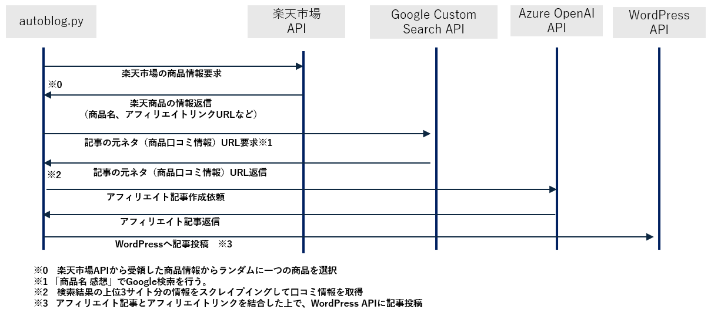

# Rakuten Affiliate Blog Automation with WordPress

このプロジェクトは、楽天市場APIを利用して商品情報を取得し、Google Custom Search APIで取得した口コミ情報を基にAzure OpenAI APIを使用してアフィリエイト記事を自動生成し、WordPressに投稿するシステムです。

## 機能概要
- 楽天市場APIを使用してランダムに商品情報を抽出
- Google Custom Search APIを使用して商品の口コミ情報を検索・取得
- Azure OpenAI APIを使用してアフィリエイト記事を自動生成
- WordPress APIを使用してブログ記事を自動投稿
- ダウンロードした画像をWordPressにアップロードしてアイキャッチ画像として設定

## コードのシーケンス図

以下は、コードの流れを図示したものです。この図は、プロジェクトがどのように動作するかを理解するのに役立ちます。

## デモサイト

AIが生成した記事が実際に掲載されているデモサイトはこちらです:

[AI生成記事のデモサイト - mitsuru-media2](https://mitsuru-media2.com/)

このサイトでは、AIを使用して作成された記事が投稿されており、プロジェクトの成果物を確認することができます。実際に記事がどのように生成され、投稿されるかをご覧いただけます。

## 使用技術
- Python 3.12.4
- 楽天市場API
- Google Custom Search API
- Azure OpenAI API
- WordPress REST API
- BeautifulSoup
- Requests
- Pillow (Python Imaging Library)

## 環境設定

このプロジェクトを実行するには、以下の環境変数を`.env`ファイルに設定する必要があります。

### 必要な環境変数

| 環境変数        | 説明                                                            |
|-----------------|----------------------------------------------------------------|
| `RAKUTEN_APP_ID`| 楽天市場APIのアプリケーションID  https://webservice.faq.rakuten.net/hc/ja/articles/900001970586-%E3%82%A2%E3%83%97%E3%83%AA%E3%82%B1%E3%83%BC%E3%82%B7%E3%83%A7%E3%83%B3ID%E3%81%A8%E3%81%AF%E4%BD%95%E3%81%A7%E3%81%99%E3%81%8B|
| `LOG_DIR`       | ログファイルを保存するディレクトリパス                              |
| `IMAGE_SAVE_PATH`| ダウンロードした商品画像を保存するディレクトリのパス               |
| `IMAGE_UPLOAD_URL`| 画像をWordPressにアップロードするAPIエンドポイントURL             |
| `WORDPRESS_USER`| WordPressのユーザー名                                             |
| `AUTH_PASS`     | WordPressの認証パスワード                                         |
| `AZURE_URL`     | Azure OpenAI APIのエンドポイントURL                               |
| `AZURE_API_KEY` | Azure OpenAI APIのAPIキー                                        |
| `SEARCH_API_KEY`| Google Custom Search APIのAPIキー                                 |
| `SEARCH_ENGINE_ID`| Google Custom Search APIの検索エンジンID                        |
| `CATEGORY_ID`   | WordPressの投稿カテゴリID                                        |
| `END_POINT_URL` | WordPress REST APIのエンドポイントURL                             |

### `.env`ファイル例

RAKUTEN_APP_ID=your_rakuten_app_id  
LOG_DIR=/path/to/logs  
IMAGE_SAVE_PATH=/path/to/images  
IMAGE_UPLOAD_URL=https://your-wordpress-site.com/wp-json/wp/v2/media  
WORDPRESS_USER=your_wordpress_username  
AUTH_PASS=your_wordpress_password  
AZURE_URL=https://your-azure-openai-endpoint  
AZURE_API_KEY=your_azure_openai_api_key  
SEARCH_API_KEY=your_google_search_api_key  
SEARCH_ENGINE_ID=your_search_engine_id  
CATEGORY_ID=your_wordpress_category_id  
END_POINT_URL=https://your-wordpress-site.com/wp-json/wp/v2/posts

## インストールと実行方法
#### リポジトリをクローン
git clone https://github.com/your_username/your_repository_name.git  
cd your_repository_name

#### 必要なパッケージをインストール
以下のコマンドで必要なPythonパッケージをインストールします。   
pip install -r requirements.txt

#### 環境変数の設定
プロジェクトルートに.envファイルを作成し、上記の必要な環境変数を設定してください。

#### スクリプトを実行 設定が完了したら、以下のコマンドでスクリプトを実行します。
python your_script_name.py

## ライセンス
このプロジェクトは [MITライセンス](./LICENSE) のもとで公開されています。